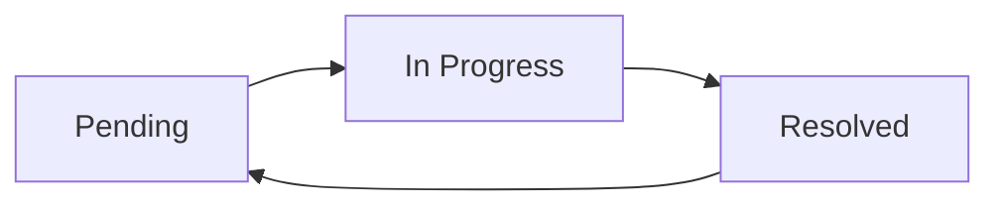

# Single Page Bug and Feature Tracker Proposal

## Goal

Create a web-hosted, single page tracker for bugs and feature requests that keeps intake lightweight while making open work easy to scan, filter, group, and triage.

The default experience should be a concise task-card list grouped by priority, with a top summary table that shows open counts by area. Screenshots stay collapsed by default and expand only when a reviewer needs visual evidence or the attached log.

## Research-backed design direction

This proposal follows common patterns from mature issue trackers:

- Jira treats type, status, priority, and resolution as core fields for reporting where work is, how important it is, and what kind of work it represents. Its default software work types include Bug, and Jira Service Management includes New feature as a request type. Source: [Atlassian work types](https://support.atlassian.com/jira-cloud-administration/docs/what-are-issue-types/) and [Atlassian statuses and priorities](https://support.atlassian.com/jira-cloud-administration/docs/what-are-issue-statuses-priorities-and-resolutions/).
- GitHub Projects supports custom fields, table/list views, filtering, sorting, grouping, charts, and metadata such as assignee, labels, and issue type. Source: [GitHub Projects overview](https://docs.github.com/en/issues/planning-and-tracking-with-projects/learning-about-projects/about-projects).
- GitHub Issues emphasizes metadata, assignees, templates, and filters for quickly finding open work by ownership and classification. Source: [GitHub Issues overview](https://docs.github.com/en/issues/tracking-your-work-with-issues/learning-about-issues/about-issues) and [GitHub filtering](https://docs.github.com/en/issues/tracking-your-work-with-issues/using-issues/filtering-and-searching-issues-and-pull-requests).
- Linear keeps priority simple, warning that too many priority levels make triage harder; it also supports durable filtered views, group headers, and collapsible groups in list view. Source: [Linear priority](https://linear.app/docs/priority) and [Linear custom views](https://linear.app/docs/custom-views).
- Recent issue-tracking research supports screenshots as useful context for triage, especially for user-facing app issues, but screenshots should add clarity rather than crowd the primary list. Source: [Using Screenshot Attachments in Issue Reports for Triaging](https://arxiv.org/abs/2306.03634) and [ImageR: Enhancing Bug Report Clarity by Screenshots](https://arxiv.org/abs/2505.01925).

## Primary users

- Product and QA reviewers who need to spot urgent issues quickly.
- Engineers and owners who need a filtered list of work assigned to them.
- Stakeholders who need area-level open counts without reading every item.

## Field model

| Field | Control | Values and rules |
| --- | --- | --- |
| Type | Segmented control | Bug, Feature |
| Description | Text input | Free text, required, 50 character maximum |
| Area | Single-select menu | Dashboard, Net Worth, Portfolio, Performance & Income, Financial, Property, Estate & Entities, Contacts, Taxes, Insurance, All Files, Profit & Loss, Balance Sheet, Cash Flow, Ledger, Analysis |
| Priority | Single-select menu | Critical, High, Medium, Low |
| Owner | Single-select menu | Fudge, Refay, Duncan, Penman |
| Screenshot | Paste zone plus collapsed attachment row | Accept pasted image from clipboard, upload, or drag-drop; collapsed by default |
| Status | Segmented control | Pending, In Progress, Resolved |

Area values are the category labels visible in `Catagories.pdf`: Dashboard, Net Worth, Portfolio, Performance & Income, Financial, Property, Estate & Entities, Contacts, Taxes, Insurance, All Files, Profit & Loss, Balance Sheet, Cash Flow, Ledger, and Analysis. The Atlas/Activity strip in the screenshot is treated as navigation context rather than an issue area.

## Default layout

```text
+----------------------------------------------------------------------------------+
| Bug and Feature Tracker                                      + New item   Export  |
| Open 192    Bugs 160    Features 32    Critical 48    In Progress 96             |
+----------------------------------------------------------------------------------+
| Area                    Open   Bugs   Features | Area             Open Bugs Feat |
| Dashboard                 12     10          2 | Financial          12   10    2 |
| Net Worth                 12     10          2 | Property           12   10    2 |
| Portfolio                 12     10          2 | Taxes              12   10    2 |
| Performance & Income      12     10          2 | Balance Sheet      12   10    2 |
| ...all category rows continue in the table...                                      |
+----------------------------------------------------------------------------------+
| Search description...   Type: All   Owner: All   Status: Open   Sort: Priority    |
| Group by: Priority      Area: All   Clear filters                                  |
+----------------------------------------------------------------------------------+
| CRITICAL  12                                                                       |
| [Bug] App freezes on submit             Dashboard    Fudge   Pending      [image] |
|       Payment confirm button hangs      #DA-1049      1 log   expand screenshot > |
| [Feature] Add bulk property import      Property     Penman  In Progress  [none]  |
|       CSV import for active listings    #PR-2041              no screenshot       |
+----------------------------------------------------------------------------------+
| HIGH  38                                                                           |
| [Bug] Balance total miscalculates       Financial    Refay   In Progress  [image] |
|       Rounding issue on summary row     #FN-3180      3 logs  expand screenshot > |
+----------------------------------------------------------------------------------+
| MEDIUM  91                                                                         |
| ...                                                                              |
+----------------------------------------------------------------------------------+
| LOW  75                                                                            |
| ...                                                                              |
+----------------------------------------------------------------------------------+
```

## Task card anatomy

Each row should remain short enough to scan in a dense list:

```text
[Type] Description                         Area       Owner   Status       Evidence
       Short supporting line or item id     Priority   Logs    Updated      Expand
```

Visible by default:

- Type badge: Bug or Feature.
- Description: capped at 50 characters.
- Area, priority, owner, and status.
- Evidence indicator: image count and log count.
- Expand control for screenshot and activity log.

Hidden until expanded:

- Full screenshot preview.
- Screenshot metadata, including uploaded by and timestamp.
- Activity log for status, owner, priority, and screenshot changes.

## Interactions

### Add item

The `+ New item` button opens a right-side drawer so users can add work without losing the current list context.

Required fields:

- Type
- Description
- Area
- Priority
- Owner
- Status

Screenshot is optional, but the paste target should be visible in the drawer:

```text
Paste screenshot here
or drag an image into this box
```

Validation:

- Description cannot exceed 50 characters.
- Required selects must be filled before saving.
- A pasted screenshot is compressed for thumbnail display while preserving an expandable original.

### Filter and sort

The filter bar supports:

- Type: All, Bug, Feature
- Priority: All, Critical, High, Medium, Low
- Owner: All, Fudge, Refay, Duncan, Penman
- Status: All, Pending, In Progress, Resolved, Open
- Area: All, Dashboard, Net Worth, Portfolio, Performance & Income, Financial, Property, Estate & Entities, Contacts, Taxes, Insurance, All Files, Profit & Loss, Balance Sheet, Cash Flow, Ledger, Analysis
- Text search across description

Default:

- Status filter: Open, meaning Pending plus In Progress.
- Group by: Priority.
- Sort inside each group: Critical to Low, then newest updated first.

Saved views:

- My open items: Owner equals current user, Status equals Open.
- Bugs only: Type equals Bug, Status equals Open.
- Features only: Type equals Feature, Status equals Open.
- Resolved this week: Status equals Resolved, updated in last seven days.

### Grouping

Users can group by:

- Priority
- Owner
- Type
- Status
- Area

Priority is the default because it answers the first triage question: what needs attention first?

### Counts

The top header contains two count layers:

1. Global counts: total open, open bugs, open features, critical, and in-progress.
2. Area table: open, bugs, and features for each area.

Example area count table:

| Area | Open | Bugs | Features |
| --- | ---: | ---: | ---: |
| Dashboard | 12 | 10 | 2 |
| Net Worth | 12 | 10 | 2 |
| Portfolio | 12 | 10 | 2 |
| Performance & Income | 12 | 10 | 2 |
| Financial | 12 | 10 | 2 |
| Property | 12 | 10 | 2 |
| Estate & Entities | 12 | 10 | 2 |
| Contacts | 12 | 10 | 2 |
| Taxes | 12 | 10 | 2 |
| Insurance | 12 | 10 | 2 |
| All Files | 12 | 10 | 2 |
| Profit & Loss | 12 | 10 | 2 |
| Balance Sheet | 12 | 10 | 2 |
| Cash Flow | 12 | 10 | 2 |
| Ledger | 12 | 10 | 2 |
| Analysis | 12 | 10 | 2 |

Resolved items are excluded from Open counts but remain searchable through the Status filter.

## Status workflow



Workflow rules:

- New items default to Pending unless created from a filtered view with a selected status.
- Moving to In Progress requires an owner.
- Moving to Resolved records resolved timestamp and resolver.
- Resolved items can be reopened to Pending if verification fails.

## Visual design guidance

- Use a dense list, not a kanban board, as the default because the primary need is scan, compare, filter, and triage many items at once.
- Use restrained color only for priority and status. Critical should be the strongest visual treatment.
- Keep screenshots collapsed to preserve vertical space.
- Make priority group headers sticky while scrolling.
- Use compact icon buttons for screenshot expansion, edit, and delete.
- Keep card corners subtle, at 8px radius or less.
- Avoid nested cards; the page is a full-width work surface with rows and expandable details.

## Accessibility and usability

- Every filter and row action must be keyboard reachable.
- Priority should not rely on color alone; include visible text labels.
- Screenshot expanders need accessible names such as `Expand screenshot for DA-1049`.
- Top counts should be real text, not only chart graphics.
- The description counter should show remaining characters as the user types.

## Data shape

```json
{
  "id": "DA-1049",
  "type": "Bug",
  "description": "Payment confirm button hangs",
  "area": "Dashboard",
  "priority": "Critical",
  "owner": "Fudge",
  "status": "Pending",
  "screenshot": {
    "thumbnailUrl": "/attachments/DA-1049-thumb.jpg",
    "fullUrl": "/attachments/DA-1049.jpg",
    "createdAt": "2026-07-08T15:04:00-06:00"
  },
  "log": [
    {
      "at": "2026-07-08T15:04:00-06:00",
      "actor": "Fudge",
      "action": "Created issue"
    }
  ],
  "createdAt": "2026-07-08T15:04:00-06:00",
  "updatedAt": "2026-07-08T15:04:00-06:00"
}
```

## Acceptance criteria

- The page opens to a priority-grouped list of all open bugs and features.
- Open counts are visible in the header and broken down by area.
- Users can filter by priority, owner, type, status, and area.
- Users can group by priority, owner, type, status, or area.
- Screenshots can be pasted into a field during item creation or edit.
- Screenshots are collapsed by default and expand inline with the item log.
- Description input enforces a 50 character limit.
- Resolved items disappear from the default open view but remain available through filters.

## Recommended first build

Build the first version as a single page web app with:

- Header summary and area count table.
- Filter bar and group-by selector.
- Priority-grouped compact list.
- Add/edit drawer.
- Clipboard paste support for screenshots.
- Expandable screenshot and log detail row.
- Local seed data matching the example counts, followed by API persistence when backend endpoints are available.
